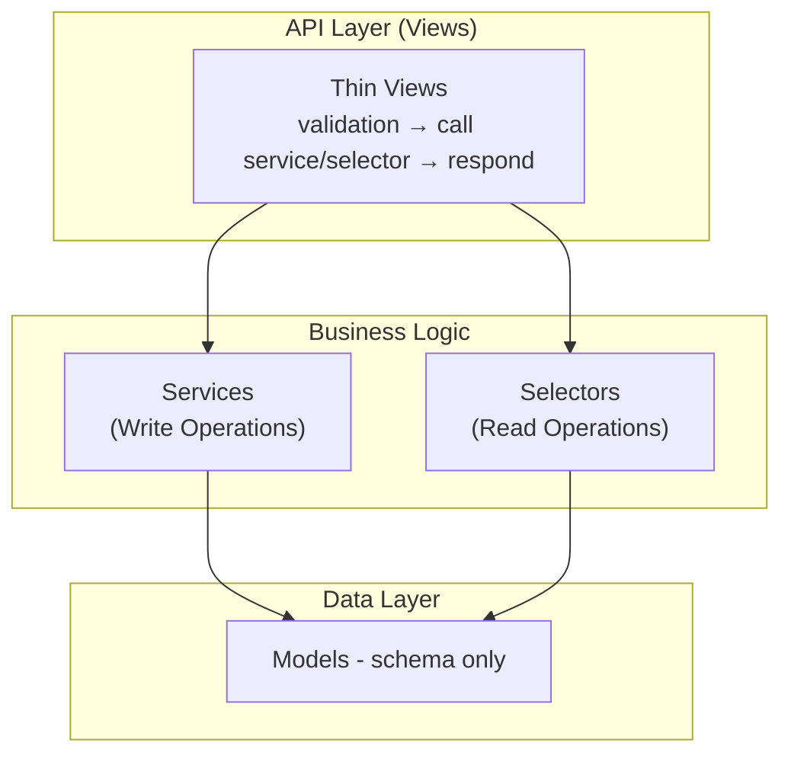

# Django Velocity

A modern, opinionated Django boilerplate implementing **Service-Oriented Architecture** following the [HackSoftware Django Styleguide](https://github.com/HackSoftware/Django-Styleguide).

## ✨ Features

- **Service-Oriented Architecture** - Business logic in Services & Selectors, not Views
- **Custom User Model** - Email-based authentication from day one
- **JWT Authentication** - Secure token-based auth with refresh tokens
- **Django REST Framework** - Powerful and flexible REST API framework
- **Django Channels** - WebSocket support with Redis channel layers
- **Celery + Beat** - Async task processing and scheduled tasks with Redis
- **Modern Admin UI** - Beautiful admin interface with [django-unfold](https://unfoldadmin.com/)
- **Modern Python** - Python 3.12+, type hints, Ruff for linting
- **Docker Ready** - Docker Compose setup for development
- **Testing** - pytest + factory_boy with comprehensive examples
- **Task Runner** - `just` commands for common operations

## 🏗 Architecture




### Why This Architecture?

| Traditional Django         | Service-Oriented (This Boilerplate)         |
|---------------------------|---------------------------------------------|
| Fat models with logic     | Anemic models (schema only)                 |
| Logic scattered in views  | Business logic in dedicated services        |
| Hard to test              | Unit tests for services/selectors           |
| Difficult to maintain     | Clear separation of concerns                |

## 🚀 Quick Start

### Prerequisites

- [Python 3.12](https://www.python.org/downloads/)
- [uv](https://github.com/indygreg/uv) (Python manager)
- [just](https://github.com/casey/just) (task runner)
- Docker & Docker Compose

### Setup

```bash
# Clone the repository
git clone <repo-url> django-velocity
cd django-velocity

# Start Docker containers
just up

# Run migrations
just migrate

# Create superuser
just createsuperuser

# Open http://localhost:8000/admin/
```

### Development Commands

```bash
just              # Show all available commands
just up           # Start containers
just down         # Stop containers
just logs         # View logs
just shell        # Django shell (IPython)
just test         # Run tests
just test-cov     # Run tests with coverage
just lint         # Run Ruff linter
just fmt          # Format code with Ruff
just manage <cmd> # Run any manage.py command
just db-backup    # Create a database backup
just db-restore <file>  # Restore from backup
```

## 📁 Project Structure

```
django-velocity/
├── config/                 # Django project configuration
│   ├── django/             # Django-specific settings
│   │   ├── base.py         # Base settings
│   │   ├── local.py        # Development settings
│   │   ├── production.py   # Production settings
│   │   └── test.py         # Test settings
│   ├── settings/           # Third-party integrations
│   │   ├── allauth.py      # django-allauth config
│   │   ├── email.py        # Email configuration
│   │   ├── jwt.py          # SimpleJWT settings
│   │   ├── rest_framework.py # DRF settings
│   │   └── unfold.py       # Django Unfold admin theme
│   ├── urls.py
│   └── wsgi.py
│
├── apps/                   # Domain applications
│   ├── core/               # Shared utilities
│   │   ├── exceptions.py   # Business exception hierarchy
│   │   ├── models.py       # BaseModel with timestamps
│   │   └── services.py     # @service decorator
│   │
│   ├── authentication/     # Authentication domain
│   │   ├── models.py       # Auth-related models
│   │   ├── services.py     # register_user, login_user, password reset...
│   │   ├── serializers.py  # Auth serializers
│   │   ├── views.py        # Auth API views
│   │   └── tests/
│   │
│   └── users/              # User domain
│       ├── models.py       # Custom User model
│       ├── services.py     # user_update, user_change_password...
│       ├── selectors.py    # user_get_by_email, user_list...
│       ├── views.py        # User profile API views
│       └── tests/
│
└── tests/                  # Project-wide test utilities
    ├── conftest.py         # pytest fixtures
    └── factories.py        # FactoryBoy factories
```

## 📝 Code Examples

### Service (Business Logic)

```python
# apps/authentication/services.py
from apps.core.services import service
from apps.core.exceptions import ValidationError

@service
def register_user(*, email: str, password: str, first_name: str = "", last_name: str = "") -> dict:
    """Register a new user and return JWT tokens."""
    if user_get_by_email(email=email):
        raise ValidationError("Email already registered")

    user = User.objects.create_user(email=email, password=password)
    tokens = generate_tokens_for_user(user)
    return {"user": user, **tokens}
```

```python
# apps/users/services.py - Profile management
@service
def user_update(*, user: User, first_name: str | None = None, last_name: str | None = None) -> User:
    """Update user profile information."""
    if first_name is not None:
        user.first_name = first_name
    if last_name is not None:
        user.last_name = last_name
    user.save(update_fields=["first_name", "last_name", "updated_at"])
    return user
```

### Selector (Read Operations)

```python
# apps/users/selectors.py
def user_get_by_email(*, email: str) -> User | None:
    """Fetch user by email - read only, no side effects."""
    try:
        return User.objects.get(email__iexact=email)
    except User.DoesNotExist:
        return None
```

### Thin View (API Layer)

```python
# apps/authentication/views.py
class RegisterView(APIView):
    permission_classes = [AllowAny]

    def post(self, request):
        serializer = RegisterInputSerializer(data=request.data)
        serializer.is_valid(raise_exception=True)

        # Delegate to service - view is thin!
        result = services.register_user(**serializer.validated_data)

        return Response(RegisterOutputSerializer(result).data, status=201)
```

## 🔌 API Endpoints

### Authentication (`/api/auth/`)

| Method | Endpoint                      | Description             |
|--------|-------------------------------|-------------------------|
| POST   | `/api/auth/register/`         | Register new user       |
| POST   | `/api/auth/login/`            | Login, get JWT tokens   |
| POST   | `/api/auth/token/refresh/`    | Refresh access token    |
| POST   | `/api/auth/forgot-password/`  | Request password reset  |
| POST   | `/api/auth/reset-password/`   | Confirm password reset  |
| POST   | `/api/auth/verify-email/`     | Verify email address    |
| POST   | `/api/auth/change-password/`  | Change password (auth)  |

### User Management (`/api/users/`)

| Method | Endpoint                      | Description          |
|--------|-------------------------------|----------------------|
| GET    | `/api/users/me/`              | Get current user     |
| PATCH  | `/api/users/me/`              | Update profile       |


## 🗄️ Database Backups

CLI-based PostgreSQL backup system with `just` commands:

```bash
just db-backup          # Create backup (non-blocking, no downtime)
just db-backup-list     # List available backups
just db-restore <file>  # Restore (stops services automatically)
just db-backup-cleanup  # Remove old backups
```

See [Database Backups](docs/backups.md) for full details.

## 🧪 Testing

```bash
# Run all tests
just test

# Run with coverage
just test-cov

# Run specific test file
just test apps/users/tests/test_services.py

# Run specific test
just test apps/users/tests/test_services.py::TestUserCreate::test_creates_user_successfully
```

### Test Strategy

1. **Unit Tests** (Primary) - Test services and selectors directly
2. **Integration Tests** - Test API endpoints through HTTP
3. **No View Logic Tests** - Views are thin, logic is in services

## 🔧 Configuration

### Environment Variables

Copy `.env.example` to `.env` and configure:

```bash
DEBUG=True
SECRET_KEY=your-secret-key
DATABASE_URL=postgres://postgres:postgres@db:5432/velocity
```


## 📦 Dependencies

| Package                      | Purpose                          |
|-----------------------------|----------------------------------|
| Django 6.0+                 | Web framework                    |
| djangorestframework         | REST API framework               |
| djangorestframework-simplejwt| JWT authentication              |
| celery                      | Async task processing            |
| django-celery-beat          | Scheduled/periodic tasks         |
| django-unfold               | Modern admin theme               |
| psycopg 3                   | PostgreSQL adapter               |
| django-environ              | Environment configuration        |
| whitenoise                  | Static file serving              |
| pytest-django               | Testing                          |
| factory-boy                 | Test data generation             |
| ruff                        | Linting & formatting             |

## 📚 Documentation

This project uses [Zensical](https://zensical.org/) for documentation generation.

- [Getting Started](docs/getting-started.md)
- [Architecture](docs/architecture.md)
- [API Reference](docs/api/index.md)
- [Celery & Tasks](docs/celery.md)
- [Database Backups](docs/backups.md)
- [Deployment](docs/deployment.md)
- [Contributing](docs/contributing.md)

```bash
# Build documentation
just docs

# Serve documentation locally with hot-reload
just docs-serve
# Then open http://localhost:8000
```

## 🤝 Contributing

Contributions are welcome! See [Contributing Guide](docs/contributing.md) for details.

## 📄 License

MIT

---

Built following the [HackSoftware Django Styleguide](https://github.com/HackSoftware/Django-Styleguide)
