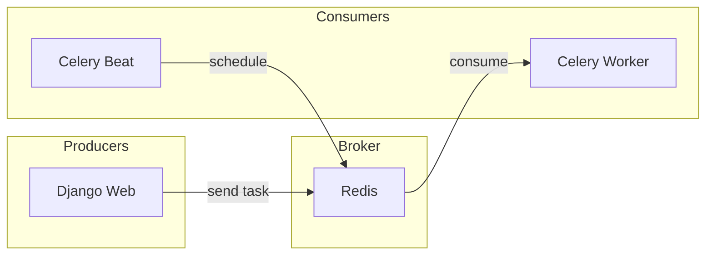

# Celery & Tasks

Django Velocity includes Celery for async task processing and Celery Beat for scheduled tasks.

## Architecture




## Quick Start

All services start with `just up`:

```bash
just up           # Starts web, db, redis, celery-worker, celery-beat
just celery-logs  # View worker logs
just celery-beat-logs  # View beat scheduler logs
```

## Creating Tasks

Following the HackSoft styleguide, tasks are **thin wrappers** that call services:

```python title="apps/tasks/tasks.py"
from celery import shared_task
from apps.users.services import cleanup_inactive_users

@shared_task
def cleanup_inactive_users_task() -> int:
    """
    Periodic task to cleanup inactive users.
    Task is thin - delegates to service for business logic.
    """
    return cleanup_inactive_users()
```

!!! tip "Task Pattern"
    Tasks should NOT contain business logic. They should:

    1. Accept simple, serializable arguments
    2. Call a service function
    3. Return a serializable result

### Calling Tasks

```python
# Immediate async execution
example_task.delay("Hello!")

# With countdown (execute after 60 seconds)
example_task.apply_async(args=["Hello!"], countdown=60)

# With ETA (execute at specific time)
from datetime import datetime, timedelta
example_task.apply_async(args=["Hello!"], eta=datetime.now() + timedelta(hours=1))
```

## Periodic Tasks (Beat)

Scheduled tasks use `django-celery-beat` with database-backed scheduling.

### Via Admin Panel

1. Go to **Admin → Periodic Tasks → Periodic Tasks**
2. Create a new periodic task
3. Select your task and schedule (interval, crontab, etc.)

### Programmatic Registration

Create a service for registering periodic tasks:

```python title="apps/tasks/services.py"
from django_celery_beat.models import IntervalSchedule, PeriodicTask


def register_periodic_task(
    *,
    name: str,
    task_path: str,
    every: int,
    period: str = IntervalSchedule.MINUTES,
    enabled: bool = True,
) -> PeriodicTask:
    """Register or update a periodic task with interval schedule."""
    schedule, _ = IntervalSchedule.objects.get_or_create(
        every=every,
        period=period,
    )
    periodic_task, _ = PeriodicTask.objects.update_or_create(
        name=name,
        defaults={
            "task": task_path,
            "interval": schedule,
            "enabled": enabled,
        },
    )
    return periodic_task
```

Then call from `apps.py`:

```python title="apps/tasks/apps.py"
from django.apps import AppConfig


class TasksConfig(AppConfig):
    name = "apps.tasks"

    def ready(self):
        from apps.tasks.services import register_periodic_task

        register_periodic_task(
            name="Cleanup inactive users",
            task_path="apps.tasks.tasks.cleanup_inactive_users_task",
            every=30,
        )
```

## Configuration

Configuration in `config/settings/celery.py`:

| Setting | Default | Description |
|---------|---------|-------------|
| `CELERY_BROKER_URL` | `redis://redis:6379/0` | Redis connection |
| `CELERY_RESULT_BACKEND` | `redis://redis:6379/0` | Store task results |
| `CELERY_TASK_TIME_LIMIT` | 30 minutes | Max task runtime |
| `CELERY_BEAT_SCHEDULER` | `DatabaseScheduler` | django-celery-beat |

## Testing Tasks

Test tasks synchronously by calling directly:

```python title="apps/tasks/tests/test_tasks.py"
import pytest
from apps.tasks.tasks import example_task

class TestExampleTask:
    def test_processes_message(self):
        result = example_task("Hello")
        assert result == "Processed: Hello"
```

For integration tests with Celery, use `celery_app` fixture:

```python
@pytest.fixture
def celery_app(settings):
    settings.CELERY_TASK_ALWAYS_EAGER = True
    settings.CELERY_TASK_EAGER_PROPAGATES = True
```

## Docker Services

| Service | Command | Purpose |
|---------|---------|---------|
| `celery-worker` | `celery -A config worker -l info` | Process tasks |
| `celery-beat` | `celery -A config beat -l info` | Schedule periodic tasks |
